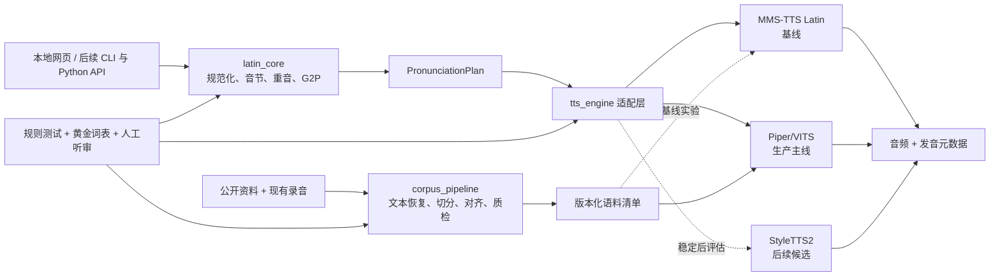

# LatinTTS 系统设计

- 状态：已批准
- 批准日期：2026-07-17
- 目标发音：现代罗马/意大利式教会拉丁语
- 首个实现周期：单词与短语发音基础

## 1. 概述

LatinTTS 是一个本地运行的教会式拉丁语 TTS 工具。它优先保证发音规则、音节与重音正确，其次保证声音清晰、听感自然。首版服务单词和短语学习；句子、祷文与经文的长文本朗读另行设计。

系统采用“规则优先、模型可替换”的分层架构。文本先转换为可检查、可追溯的 `PronunciationPlan`，再交给声学模型。MMS-TTS Latin 用于建立基线，Piper/VITS 是首版生产主线；只有当规则、数据和评测集稳定后，才评估 StyleTTS2。

## 2. 已确认的约束

- 首要场景是单词和短语发音，随后扩展到句子与经文朗读。
- 发音标准采用现代罗马/意大利式教会拉丁语。
- 用户先收集公开资料并制定完整发音规则，再处理现有录音。
- 现有语料少于 5 小时，来自一位发音可靠、录音环境安静的朗读者；录音没有现成逐句转写，但祷文与经文名称已知。
- 音色不设为硬指标。质量优先级为：发音正确、重音正确、清晰、自然、音色相似。
- 最终成果用于个人研究和本地使用。
- 本机为 NVIDIA GeForce RTX 4080 Laptop GPU，显存约 12 GB；采用开源预训练模型微调，不从零训练大型模型。
- 首版为本地网页，随后提供 CLI 和 Python API。
- 用户默认输入普通文本；系统显示音节、重音和音素，并允许人工覆盖。
- 输入支持 `æ/ae`、`œ/oe`、`j/i`、`u/v` 等常见拼写变体。
- 规则验收同时使用自动测试和人工听审。

## 3. 目标与非目标

### 3.1 目标

1. 建立有来源、有版本、可测试的教会式拉丁语发音规范。
2. 将普通拉丁文本转换为可解释的音节、重音、IPA 和训练音素。
3. 恢复现有录音的准确文本，完成切分、强制对齐和质量审核。
4. 使用同一应用接口比较 MMS 基线与 Piper 主线。
5. 在本机提供分析、人工纠正、试听和导出的完整闭环。
6. 保存足够的来源和版本信息，使每次合成都能复现。

### 3.2 首版非目标

- 古典拉丁语或多种地域发音体系。
- 中世纪手稿缩写和大量历史拼写变体。
- 多说话人、音色克隆或声音市场。
- 云端服务、移动应用或商业发布。
- 歌唱、额我略圣咏或乐谱到歌声生成。
- 未经审核的公开录音直接混入主训练集。
- 在单词和短语尚未达标前处理长文本韵律。

## 4. 发音规范

### 4.1 规范依据

发音规则以现代罗马教会式传统为目标。规则文档应把权威出版物、辅助词典、公开教学材料和现有可靠录音分开登记，不能把单一网络示例当作最终规范。

建议的来源优先级为：

1. 规范性或传统权威资料，例如《Liber Usualis》中关于礼仪拉丁语读音的章节。
2. 有编辑或学术来源的词典、重音与元音长度资料。
3. 经审核的教会式拉丁语教学资料。
4. 发音可靠且文本明确的现有录音。
5. 公开平台上的候选录音，仅用于补充和交叉检查。

如果来源冲突，规则文档必须记录冲突、采用的解释和理由。

### 4.2 规则文档内容

规则文档至少覆盖：

- Unicode、标点、大小写和拼写变体规范化。
- 元音、双元音与相邻元音的处理。
- 辅音和关键字母组合，包括软硬 `c/g`、`sc`、`gn`、`qu`、`ti` 加元音、`x` 和 `h` 等。
- 音节划分、辅音连缀、双辅音和词间衔接。
- 双音节词、多音节词和带附着词形式的重音。
- 普通拼写不足以唯一确定重音时的词典与例外策略。
- 希腊、希伯来及其他借词的例外处理。
- 朗读中的标点停顿和短语边界；不包含歌唱韵律。
- 每条规则的正例、反例、边界例和来源。

### 4.3 规范化原则

- 始终保留原始输入供界面显示和结果追溯。
- Unicode 使用一致的内部形式。
- `æ/ae` 与 `œ/oe` 可映射到同一词典检索形式。
- `j/i` 与 `u/v` 不能通过无条件全局替换处理；系统使用变体感知的词典检索和上下文规则，避免破坏词义或辅音/元音角色。
- 规范化结果、规则版本和采用的变体映射进入 `PronunciationPlan`。

### 4.4 重音解析顺序

重音按以下优先级解析：

1. 当前请求中的人工覆盖。
2. 已确认的本地例外词条。
3. 带来源的重音词典或可推导元音长度的词典数据。
4. 确定性的通用重音规则。
5. 规则候选加 `needs_review` 警告。

普通无变音符号拼写并不总能唯一确定多音节词的重音。系统可以生成候选结果供试听，但不得把候选标成权威确定结果。

## 5. 总体架构



运行时发音、离线数据准备和质量门禁相互分离。规则层不依赖网页、数据库或具体声学模型。

## 6. 模块职责

### 6.1 `latin_core`

`latin_core` 是纯领域逻辑包，包括：

- `Normalizer`：Unicode、标点、大小写与拼写变体处理。
- `Tokenizer`：分词并保留标点和原文位置。
- `Syllabifier`：音节划分和辅音边界。
- `StressResolver`：按既定优先级确定重音或产生警告。
- `EcclesiasticalG2P`：生成罗马教会式 IPA 和生产模型音素。
- `PronunciationValidator`：验证覆盖值、未知音素和内部一致性。

这些组件使用显式输入输出，不读取全局状态。基础词典、例外表和规则均带版本。

### 6.2 `PronunciationPlan`

`PronunciationPlan` 是运行时单一事实来源。概念类型如下：

```text
PronunciationPlan {
  schema_version: string
  rule_version: string
  original_text: string
  normalized_text: string
  tokens: PronunciationToken[]
  phrase_phonemes: string[]
  warnings: PronunciationWarning[]
}

PronunciationToken {
  surface: string
  normalized: string
  source_span: [integer, integer]
  syllables: string[]
  stress_index: integer
  ipa: string
  model_phonemes: string[]
  resolution_method: "override" | "exception" | "lexicon" | "rule" | "candidate"
  source_ids: string[]
  warnings: PronunciationWarning[]
  override: PronunciationOverride | null
}
```

`source_span` 指向原始输入；所有警告都能定位到词或字符范围。人工修改首先只影响当前请求，用户确认后才能提升为本地例外词条。

### 6.3 `corpus_pipeline`

该模块负责：

- 数据来源登记、许可证与文件哈希。
- 根据作品名称检索和比对文本版本。
- 音频派生副本生成和质量分析。
- 语音活动检测、句段切分和强制对齐。
- 低置信度样本的人工复核队列。
- 版本化主清单和训练器专用格式导出。
- 数据集合划分与泄漏检查。

原始文件不可变。任何清洗、切分或重新对齐都生成派生文件和新清单版本。

### 6.4 `tts_engine`

适配层提供统一概念接口：

```text
synthesize(PronunciationPlan, SynthesisConfig) -> SynthesisResult
```

每个适配器同时声明能力：

- 是否直接接受生产音素。
- 是否支持速度、停顿或随机种子控制。
- 所需采样率与输出格式。
- 是否能完整遵守 `PronunciationPlan`。

Piper 生产适配器必须直接消费计划中的模型音素。MMS-TTS Latin 的公开检查点主要接受文本，因此它虽然接收同一个 `PronunciationPlan` 对象，但可能只消费其中的规范文本，能力标记为 `text_only_baseline`。界面必须明确显示这一限制；MMS 输出不能被当作已经遵守计划 IPA 的生产结果。

`SynthesisResult` 至少包含音频、采样率、时长、模型名称与版本、规则版本、实际引擎输入、警告和运行耗时。

### 6.5 `app_service`

应用编排层负责：

- 调用 `latin_core` 生成发音计划。
- 应用本次请求中的人工覆盖并重新验证。
- 选择模型适配器并校验其能力。
- 返回一致的结果和错误结构。
- 为网页、CLI 和 Python API 提供同一业务入口。

界面和命令行不得复制发音规则或直接绕过服务调用模型。

## 7. 公开资料与语料策略

### 7.1 公开资料的用途分层

- 规范层：用于规则说明和来源证明。
- 词典层：用于重音、元音长度、词形和例外数据。
- 评测层：用于黄金词表、发音对照和听审样本。
- 声学训练候选层：只有在许可、发音体系、朗读者一致性和音质全部通过审核后，才进入独立实验集。

首版主声学训练集只使用现有可靠单说话人录音。公开多说话人或发音体系不明的数据默认不混入。

### 7.2 来源登记

每个来源至少记录：

- 稳定标识和抓取日期。
- 原始链接或本地来源说明。
- 作者、朗读者和出版信息。
- 许可证或个人研究使用依据。
- 发音体系与可靠性评级。
- 文本范围、音频时长和格式。
- 本地文件哈希与处理版本。

### 7.3 现有录音处理流程

1. 盘点原始文件，记录哈希、格式、时长、声道、采样率和基础质量指标。
2. 根据祷文或经文名称取得候选文本，并保存来源快照。
3. 比对文本版本；存在实质歧义时进入隔离区。
4. 使用 `latin_core` 生成规范文本和候选发音计划。
5. 从原音频生成派生副本，统一训练所需格式；不覆盖原始文件。
6. 执行语音活动检测、粗切分、音素级强制对齐和边界细化。
7. 检查削波、噪声、混响、异常语速、长静音、文本不匹配和发音冲突。
8. 将低置信度样本放入人工复核队列。
9. 生成版本化 `JSONL` 主清单，再导出模型训练需要的格式。
10. 在首次训练前锁定 `train/dev/test`；同一祷文的相邻片段不能跨集合。

### 7.4 语料清单

每个片段至少包含：

- `segment_id`、数据集版本和原始录音 ID。
- 原音频哈希、派生音频路径、起止时间和时长。
- 原始文本、文本来源、规范文本和 `PronunciationPlan` 版本。
- 说话人、录音条件和来源许可。
- 对齐分数、质量指标、排除原因和人工审核状态。
- `train/dev/test` 划分。

训练器格式是主清单的可再生导出物，不是事实来源。

## 8. 模型路线

### 8.1 MMS-TTS Latin 基线

- 目标：快速获得可重复的 Latin TTS 基线，暴露公开检查点在教会式发音和重音方面的问题。
- 用法：首先做推理评测；只有基线实验需要时才进行微调。
- 限制：文本前端和实际音素控制能力有限，因此不能代替规则层，也不能作为生产正确性的证明。
- 结果：保存固定词表音频、模型版本、规范文本、计划 IPA 和人工评分。

### 8.2 Piper/VITS 主线

- 使用自定义教会式音素，直接消费 `PronunciationPlan.model_phonemes`。
- 从合适检查点微调，避免从零训练。
- 根据 12 GB 显存使用混合精度、较小批量和梯度累积。
- 导出 ONNX，验证 Windows 本地离线推理。
- 只有通过规则、清晰度和人工听审门禁后，才作为默认模型。

### 8.3 StyleTTS2 决策门槛

只有以下条件全部成立时才建立独立设计与实验：

- 发音规则和黄金词表稳定。
- 语料文本与对齐质量稳定。
- Piper 已达到发音与清晰度门槛，但自然度仍是主要短板。
- 12 GB 显存下的实验成本可以接受，或有外部算力可用。

## 9. 本地网页

首版发音工作台把以下功能集中在一个页面：

1. 普通拉丁文本输入。
2. 规范文本、音节、重音、IPA 和规则来源展示。
3. 不确定词和警告展示。
4. 单词级重音或音素人工覆盖。
5. 模型与能力状态显示。
6. 合成、播放和 WAV 导出。
7. 发音计划、规则版本和模型元数据导出。

辅助页面包括规则与词典、语料处理和评测，但首个实现周期可以先提供只读或最小管理能力。CLI 和 Python API 在网页核心闭环稳定后加入。

## 10. 错误处理

### 10.1 发音错误

- 未登录词按规则生成候选，并返回 `PRONUNCIATION_NEEDS_REVIEW`。
- 重音或文本来源冲突返回候选，不静默选择。
- 未知音素或非法覆盖在调用模型前失败，并定位到具体词。
- 带警告的候选允许用户主动试听，但结果标记为未经确认。

### 10.2 数据错误

- 文本版本不明确：`TRANSCRIPT_AMBIGUOUS`，片段进入隔离区。
- 对齐置信度低：`ALIGNMENT_LOW_CONFIDENCE`，进入人工复核。
- 音质不合格：`AUDIO_QUALITY_REJECTED`，保存具体指标和原因。
- 处理步骤可重复执行和断点续跑，只重算受影响的下游结果。

### 10.3 模型错误

- 模型不可用：`MODEL_UNAVAILABLE`。
- 引擎不支持计划要求：`ENGINE_CAPABILITY_MISMATCH`。
- 显存不足：`SYNTHESIS_OOM`，推理可降低批量后重试；训练保存可恢复配置和检查点。
- 输入超出单词/短语范围：`INPUT_SCOPE_EXCEEDED`。
- Piper 失败时不静默切换到 MMS；用户必须明确选择基线模型。

网页、CLI 和 Python API 使用相同错误代码和核心信息。

## 11. 测试与验收

### 11.1 规则测试

- 每条规则包含正常、边界和反例。
- 首版黄金词表约 300–500 词，覆盖全部字母组合、音节结构、重音类型、拼写变体和常见礼仪词汇。
- 锁定黄金词表后，规范文本、音节、重音和 IPA 必须 100% 精确匹配；任何回归阻止发布。

### 11.2 语料测试

- 验证文件哈希、来源、文本版本、片段边界、格式和清单字段。
- 自动检测重复片段和集合泄漏。
- 人工抽查中，至少 95% 的边界误差不超过约 100 ms。
- 每个排除样本都有可复现原因。

### 11.3 模型与端到端测试

- 适配器测试输出格式、采样率、音频有效性、模型版本和实际引擎输入。
- 覆盖模型缺失、未知音素、显存不足和合成中断。
- 输入常见拼写变体时，规范化结果一致。
- 应用人工覆盖后，Piper 必须使用修改后的生产音素。
- 网页、CLI 和 Python API 对同一输入返回等价发音计划。
- MMS 测试必须明确其 `text_only_baseline` 能力，不能断言输出严格遵守计划 IPA。

### 11.4 人工听审

- 核心礼仪词表不得出现重音或关键音素错误。
- 至少 95% 的评测样本被判定为发音正确且清晰。
- 清晰度中位数不低于 4/5；首版自然度不低于 3.5/5。
- MMS 与 Piper 使用盲测标签。

## 12. 实施阶段

### 阶段 1：发音规范基础

收集来源、编写规则文档、实现 `latin_core`、建立词典和黄金测试。首个详细实施计划只覆盖本阶段。

### 阶段 2：语料恢复与对齐

盘点录音、恢复文本、切分对齐、质量审核、生成版本化清单并锁定集合。

### 阶段 3：模型基线与主线

接入 MMS 基线，微调 Piper/VITS，导出 ONNX 并完成本机评测。

### 阶段 4：单词/短语 MVP

实现本地发音工作台，随后加入 CLI 和 Python API。

### 阶段 5：句子与经文朗读

单独编写规格，设计长文本切分、短语重音、停顿、呼吸组、跨句韵律和长文本评测。

## 13. 风险与缓解

| 风险 | 缓解措施 |
| --- | --- |
| 普通拼写无法唯一确定重音 | 使用带来源的重音词典、例外表和 `needs_review` |
| 少于 5 小时语料不足以获得理想自然度 | 先微调轻量模型，锁定发音质量，再决定是否补录或升级模型 |
| 已知作品名称与实际朗读版本不一致 | 保存文本快照，版本比对，歧义样本隔离并人工复核 |
| 公开录音发音体系或质量混杂 | 默认只用于规则和评测，声学训练必须单独审核 |
| MMS 无法直接遵守自定义 IPA | 标记为 `text_only_baseline`，生产正确性只由音素可控模型承担 |
| 12 GB 显存限制复杂模型训练 | 混合精度、小批量、梯度累积和检查点；StyleTTS2 延后 |
| 规则、数据和模型错误互相掩盖 | 三类质量门禁分别测试，所有结果保留版本和实际输入 |

## 14. 实施计划中的技术选择边界

本设计固定领域接口、数据流、验收门槛和阶段顺序，不固定具体 Web 框架、强制对齐器或持久化库。阶段实施计划根据 Windows、12 GB 显存、离线运行和可复现性选择具体工具；这些选择不得改变以下约束：

- `latin_core` 保持独立且可单元测试。
- `PronunciationPlan` 是发音事实来源。
- 主语料清单可版本化并能导出训练器格式。
- 生产模型必须接受受控音素。
- 所有模型与规则版本可追溯。

## 15. 参考资料起点

- [Liber Usualis 1962：礼仪拉丁语阅读与发音章节](https://archive.ccwatershed.org/media/pdfs/12/07/06/17-07-32_0.pdf)
- [Piper 官方训练文档](https://github.com/OHF-Voice/piper1-gpl/blob/main/docs/TRAINING.md)
- [Meta MMS-TTS Latin 模型页](https://huggingface.co/facebook/mms-tts-lat)
- [StyleTTS2 官方仓库](https://github.com/yl4579/StyleTTS2)
- [Wikimedia Commons：教会式拉丁语发音分类](https://commons.wikimedia.org/wiki/Category%3AEcclesiastic_Latin_pronunciation)
- [LibriVox 公版说明](https://librivox.org/pages/public-domain/)

这些链接是来源登记的起点，不代表其中所有内容都自动通过发音、许可和质量审核。
